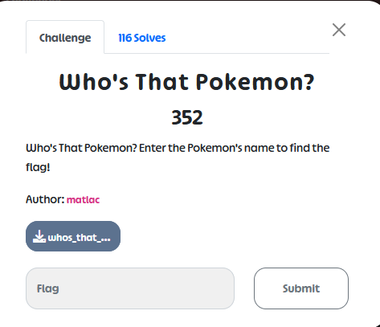

# UMDCTF2023

# Mobile:

## Prerequisite:

1. Basic knowledge about how APK applications work.
2. Rooted APK device(s).
3. jadx + frida.
4. scrcpy (optional)

Great resource: https://github.com/tsug0d/AndroidMobilePentest101

## **Who's That Pokemon?**



Put the apk file into jadx and we can read most parts of the application’s source code but we want to focus only on the MainActivity.


Skim through the code, we can see a sussy function that will decrypt something with an if-else condition.


The code snippet can simply understand that the `getGuessString()` function returns the same value as the `companion.getCorrectString()` function, the application will decrypt, decode, and then render an image that is potentially our flag. Let’s hook it with Frida:

```jsx
setTimeout(function () {
  // avoid java.lang.ClassNotFoundException

  Java.performNow(function () {
    //YOUR CODE HERE
    let MainActivity = Java.use("com.example.whosthatpokemon.MainActivity");
    MainActivity["getGuessString"].implementation = function () {
        console.log(`MainActivity.getGuessString is called`);
        let result = this["getGuessString"]();
        console.log(`MainActivity.getGuessString result=${result}`);
        return result;
    };

    let Companion = Java.use("com.example.whosthatpokemon.MainActivity$Companion");
    Companion["getCorrectString"].implementation = function () {
        console.log(`Companion.getCorrectString is called`);
        let result = this["getCorrectString"]();
        console.log(`Companion.getCorrectString result=${result}`);
        return result;
    };
  });
}, 1000);
```

```jsx
frida -U -f com.example.whosthatpokemon -l .\pokemon.js
```


Type ‘1’ in the input field and click Guess, Frida returns the result as the image below:


We can see the function that gets our input is called and the function that gets the correct string is called. What we can do now is type in the correct string and get the flag or we can force the boolean `Intrinsics.areEqual(getGuessString(), companion.getCorrectString());` return true.

I will do both ways. First one, input the correct string:


Or forcing the boolean function return true:

```jsx
setTimeout(function () {
  // avoid java.lang.ClassNotFoundException

  Java.performNow(function () {
    //YOUR CODE HERE
    let MainActivity = Java.use("com.example.whosthatpokemon.MainActivity");
    MainActivity["getGuessString"].implementation = function () {
        console.log(`MainActivity.getGuessString is called`);
        let result = this["getGuessString"]();
        console.log(`MainActivity.getGuessString result=${result}`);
        return result;
    };

    let Companion = Java.use("com.example.whosthatpokemon.MainActivity$Companion");
    Companion["getCorrectString"].implementation = function () {
        console.log(`Companion.getCorrectString is called`);
        let result = this["getCorrectString"]();
        console.log(`Companion.getCorrectString result=${result}`);
        return result;
    };
    
    let Intrinsics = Java.use("kotlin.jvm.internal.Intrinsics");
    Intrinsics["areEqual"].overload('java.lang.Object', 'java.lang.Object').implementation = function (first, second) {
        console.log(`Intrinsics.areEqual is called: first=${first}, second=${second}`);
        let result = this["areEqual"](first, second);
        console.log(`Intrinsics.areEqual result=${result}`);
        return true;
    };
  });
}, 1000);
```


## **Pokeball Escape**


Static analysis the application with Jadx:


To solve this challenge we can also have 2 ways to approach the flag.

The first one is to force the `systemInfo()` function to return the string `"Devon Corporation"`. 

The second way is forcing `Intrinsics.areEqual(systemInfo(), "Devon Corporation")` return true.

First one solution:

```jsx
setTimeout(function () {
  // avoid java.lang.ClassNotFoundException

  Java.performNow(function () {
    //YOUR CODE HERE
    let MainActivity = Java.use("com.example.pokeballescape.MainActivity");
    MainActivity["systemInfo"].implementation = function () {
        console.log(`MainActivity.systemInfo is called`);
        let result = this["systemInfo"]();
        console.log(`MainActivity.systemInfo result=${result}`);
        return "Devon Corporation";
    };

  });
}, 1000);
```

```jsx
frida -U -f com.example.pokeballescape -l .\escape.js
```


The second way:

```jsx
setTimeout(function () {
  // avoid java.lang.ClassNotFoundException

  Java.performNow(function () {
    //YOUR CODE HERE
    // let MainActivity = Java.use("com.example.pokeballescape.MainActivity");
    // MainActivity["systemInfo"].implementation = function () {
    //     console.log(`MainActivity.systemInfo is called`);
    //     let result = this["systemInfo"]();
    //     console.log(`MainActivity.systemInfo result=${result}`);
    //     return "Devon Corporation";
    // };

    let Intrinsics = Java.use("kotlin.jvm.internal.Intrinsics");
    Intrinsics["areEqual"].overload('java.lang.Object', 'java.lang.Object').implementation = function (first, second) {
        console.log(`Intrinsics.areEqual is called: first=${first}, second=${second}`);
        let result = this["areEqual"](first, second);
        console.log(`Intrinsics.areEqual result=${result}`);
        return true;
    };

  });
}, 1000);
```

```jsx
frida -U -f com.example.pokeballescape -l .\escape.js
```


## **JNIdorino**


Static analysis the application with Jadx:


This application uses the Java Native Interface (JNI) to load a native library called "jnidorino". Let’s check how many native is defined by finding all the strings contain ‘public final native’:


There are exact 500 results found. Now we will extract the apk and we can find the native libs.


I prefer x86_64 arch so I will use IDA64 to open the lib/x86_64/libjnidorino.so. Open String subview and search for all strings starting with ‘Java_’. We can see 501 strings starting with ‘Java_’ and those strings represent all the native functions that will be loaded into the application.


It is obvious that there is 1 extra function in the native lib and our mission is to find out which function is not yet defined. By using sort, uniq, and diff, the extra function has been found.


## Flamecamp


Static analysis:

```java
public static final void signIn$lambda$1$lambda$0(Function1 tmp0, Object p0) {
        Intrinsics.checkNotNullParameter(tmp0, "$tmp0");
        tmp0.invoke(p0);
    }
```

```java
public static final void signIn$lambda$1(final MainActivity this$0, Task task) {
        Intrinsics.checkNotNullParameter(this$0, "this$0");
        Intrinsics.checkNotNullParameter(task, "task");
        if (task.isSuccessful()) {
            this$0.setContentView(R.layout.post_auth);
            StorageReference storageRef = FirebaseStorage.getInstance().getReference().child("flamecamp_welcome.jpg");
            Intrinsics.checkNotNullExpressionValue(storageRef, "getInstance().reference.…(\"flamecamp_welcome.jpg\")");
            final File localFile = File.createTempFile("temp", "jpg");
            FileDownloadTask file = storageRef.getFile(localFile);
            final Function1<FileDownloadTask.TaskSnapshot, Unit> function1 = new Function1<FileDownloadTask.TaskSnapshot, Unit>() { // from class: com.example.flamecamp.MainActivity$signIn$1$1
                /* JADX INFO: Access modifiers changed from: package-private */
                /* JADX WARN: 'super' call moved to the top of the method (can break code semantics) */
                {
                    super(1);
                }

                @Override // kotlin.jvm.functions.Function1
                public /* bridge */ /* synthetic */ Unit invoke(FileDownloadTask.TaskSnapshot taskSnapshot) {
                    invoke2(taskSnapshot);
                    return Unit.INSTANCE;
                }

                /* renamed from: invoke  reason: avoid collision after fix types in other method */
                public final void invoke2(FileDownloadTask.TaskSnapshot it) {
                    Bitmap bitmap = BitmapFactory.decodeFile(localFile.getAbsolutePath());
                    ImageView imageView = (ImageView) this$0.findViewById(R.id.imageView);
                    imageView.setImageBitmap(bitmap);
                }
            };
            file.addOnSuccessListener(new OnSuccessListener() { // from class: com.example.flamecamp.MainActivity$$ExternalSyntheticLambda0
                @Override // com.google.android.gms.tasks.OnSuccessListener
                public final void onSuccess(Object obj) {
                    MainActivity.signIn$lambda$1$lambda$0(Function1.this, obj);
                }
            });
            return;
        }
        this$0.getErrorIndicator().setText("@string/signInError");
    }
```

```java
public final void signIn(View v) {
        Intrinsics.checkNotNullParameter(v, "v");
        setEmailString(getEmailInput().getText().toString());
        setPasswordString(getPasswordInput().getText().toString());
        if (!Intrinsics.areEqual(getEmailString(), "") && !Intrinsics.areEqual(getPasswordString(), "")) {
            FirebaseAuth firebaseAuth = this.auth;
            if (firebaseAuth == null) {
                Intrinsics.throwUninitializedPropertyAccessException("auth");
                firebaseAuth = null;
            }
            firebaseAuth.signInWithEmailAndPassword(getEmailString(), getPasswordString()).addOnCompleteListener(this, new OnCompleteListener() { // from class: com.example.flamecamp.MainActivity$$ExternalSyntheticLambda1
                @Override // com.google.android.gms.tasks.OnCompleteListener
                public final void onComplete(Task task) {
                    MainActivity.signIn$lambda$1(MainActivity.this, task);
                }
            });
            return;
        }
        getErrorIndicator().setText("@string/signInError");
    }
```

Those lines of code can simply understand as if we can successfully sign in, the application will download, decrypt, decode, and draw an image from the Firebase database. Try to hook the `firebaseAuth.signInWithEmailAndPassword(getEmailString(), getPasswordString())` function:

```jsx
Java.perform(function () {

	let FirebaseAuth = Java.use("com.google.firebase.auth.FirebaseAuth");
	FirebaseAuth["signInWithEmailAndPassword"].implementation = function (email, password) {
			console.log(`FirebaseAuth.signInWithEmailAndPassword is called: email=${email}, password=${password}`);
			let result = this["signInWithEmailAndPassword"](email, password);
			console.log(`FirebaseAuth.signInWithEmailAndPassword result=${result}`);
			return result;
	};

});
```


The result of the `firebaseAuth.signInWithEmailAndPassword(getEmailString(), getPasswordString())` function is a task ***`(com.google.android.gms.tasks.zzw@d2ff739)`***, and since the application throws an error indicator ***`"@string/signInError"`*** confirms that `task.isSuccessful() == false`

Follow the ***`com.google.android.gms.tasks.zzw`*** class library, we can find the `isSuccessful()` function that will override the `com.google.android.gms.tasks.Task`


Hook the `isSuccessful()` with Frida:

```jsx
Java.perform(function () {

  let FirebaseAuth = Java.use("com.google.firebase.auth.FirebaseAuth");
  FirebaseAuth["signInWithEmailAndPassword"].implementation = function (email, password) {
  		console.log(`FirebaseAuth.signInWithEmailAndPassword is called: email=${email}, password=${password}`);
  		let result = this["signInWithEmailAndPassword"](email, password);
  		console.log(`FirebaseAuth.signInWithEmailAndPassword result=${result}`);
  		return result;
  };

  let zzw = Java.use("com.google.android.gms.tasks.zzw");
  zzw["isSuccessful"].implementation = function () {
    console.log(`zzw.isSuccessful is called`);
    let result = this["isSuccessful"]();
    console.log(`zzw.isSuccessful result=${result}`);
    return result;
  };
	
});
```


The result is quite obviously, now let’s try to force the `isSuccessful()` function always return `true`

```jsx
Java.perform(function () {

  let FirebaseAuth = Java.use("com.google.firebase.auth.FirebaseAuth");
  FirebaseAuth["signInWithEmailAndPassword"].implementation = function (email, password) {
  		console.log(`FirebaseAuth.signInWithEmailAndPassword is called: email=${email}, password=${password}`);
  		let result = this["signInWithEmailAndPassword"](email, password);
  		console.log(`FirebaseAuth.signInWithEmailAndPassword result=${result}`);
  		return result;
  };

  let zzw = Java.use("com.google.android.gms.tasks.zzw");
  zzw["isSuccessful"].implementation = function () {
    console.log(`zzw.isSuccessful is called`);
    let result = this["isSuccessful"]();
    console.log(`zzw.isSuccessful result=${result}`);
    return true;
  };
	
});
```

Right after the SIGN-IN button is clicked, the application is crashed.


The log shows that we are not authenticated, therefore we are unable to download the file. So the problem is how we can get authenticated and successfully gain the token to be able to download the file. That question is bugging me until the CTF is over and the author admits that:


And yes, I was so stupid and try to complex the problem by trying to `createUserWithEmailAndPassword()` 


Meanwhile, the function `signInAnonymously()` require no argument.


This is my final payload:

```jsx
Java.perform(function () {

  let zzw = Java.use("com.google.android.gms.tasks.zzw");
  zzw["isSuccessful"].implementation = function () {
    console.log(`zzw.isSuccessful is called`);
    var FirebaseAuth = Java.use("com.google.firebase.auth.FirebaseAuth");
    var firebaseAuthInstance = FirebaseAuth.getInstance();
    var task = firebaseAuthInstance.signInAnonymously();
    let result = task["isSuccessful"]();
    console.log(`zzw.isSuccessful result=${result}`);
    return result;
  };

	let MainActivity$signIn$1$1 = Java.use("com.example.flamecamp.MainActivity$signIn$1$1");
	MainActivity$signIn$1$1["invoke"].overload('com.google.firebase.storage.FileDownloadTask$TaskSnapshot').implementation = function (it) {
			console.log(`MainActivity$signIn$1$1.invoke2 is called: it=${it}`);
			this["invoke"](it);
	};
	
});
```


Great challenges, and I learned a lot. Big thanks to the author(s).